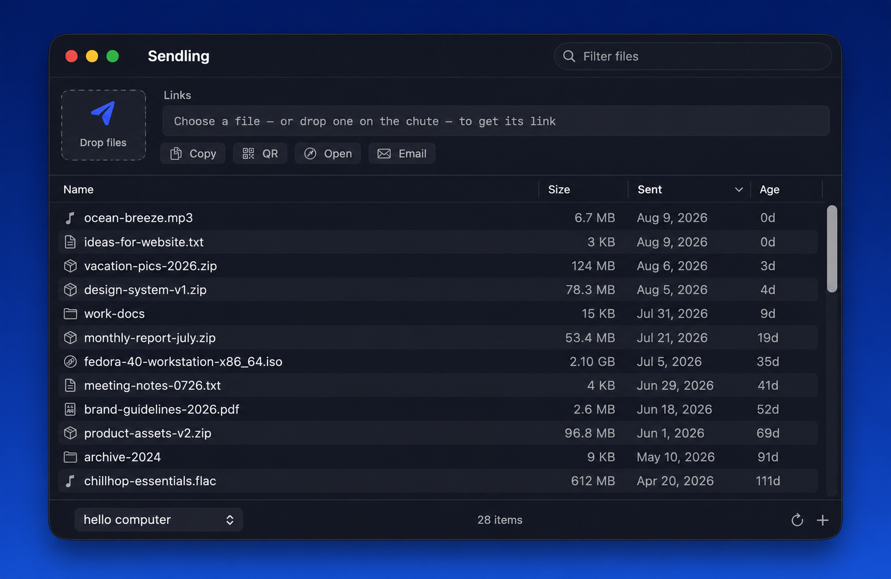

# Sendling

**Drop a file. Get a link.**

Sendling is a native macOS app that uploads files to *your own* server (SFTP, FTP, FTPS, or WebDAV) and puts a shareable download link on your clipboard. No third-party cloud, no accounts, no subscription — your server, your files, your links.

It's a modern, open-source successor to the late, great [FileChute](https://yellowmug.com/filechute/), rebuilt from scratch in Swift and SwiftUI.



## Features

- **Two drop wells** — drop on **Send** to upload as-is, or on **Compress** to zip everything into one archive first. Dropping anywhere else on the window (or the Dock icon, or ⌘O) does a normal send.
- **Your server, your rules** — SFTP (password or SSH key), FTP, FTPS, WebDAV, Nextcloud, and Dropbox
- **Real share links** — Nextcloud accounts get `/s/…` links via the OCS API; Dropbox accounts get proper share links (one-time OAuth setup with your own app key)
- **Protected & expiring links** — set a per-account link password and auto-expiry (Nextcloud; Dropbox needs a paid plan)
- **Finder integration** — right-click any file → Services → **Send with Sendling** (or **Compress & Send**), no need to open the app
- **Watched folder** — point Sendling at a folder and anything dropped in uploads automatically
- **Test Connection** — verify a server's host, credentials, and directory before you rely on it
- **Send options** — hold **⌥ Option** while dropping (or clicking a well) to set a one-off remote filename, archive choice, and link password/expiry for that send
- **Optimize images** — optionally downscale/recompress large images before upload
- **Automate it** — `sendling://send?path=/file&compress=1` works from Shortcuts (Open URL), Automator, or `open`
- **In-app updates** — checks GitHub and can download + install the new version in place
- **Copy as Markdown / HTML**, retry failed uploads, and more
- **Instant links** — download URL copied to your clipboard the moment the upload finishes
- **Archives on the fly** — wrap files/folders as `zip`, `tar.gz`, or `dmg`, optionally password-protected, with `.DS_Store` excluded
- **Smart naming** — archive names from the item name, a random string (harder to guess on your server), or both
- **Sent-file history** — sortable table with name, size, send date, and age; filter with the search field
- **Expiry** — set per-account expiry in days, see ages tick up (orange → red), and delete expired files from the server with ⌘D or automatically at launch
- **Refresh** — loads the server's real directory listing: files uploaded from anywhere appear, sizes sync, and vanished files get flagged (WebDAV verifies via HEAD instead)
- **QR codes** — show a scannable code for any link, perfect for handing a file to a phone
- **Menu bar extra** — recent links one click away, send files without the main window
- **Multiple accounts** — switch with ⌘1–⌘9
- **Per-file actions** — copy link, open in browser, compose email, delete from server (right-click or the Links menu)
- **Quick delete** — the `×` on each row deletes that file from the server after a confirmation; hold **⌘ Command** while clicking (or press **⌘⌫**) to skip the confirmation and delete immediately
- **iCloud sync** — turn on in Settings to sync accounts and history across your Macs via iCloud Drive (passwords stay on each Mac)
- **Native notifications** and optional completion sounds
- **FileChute migration** — one-click account import if FileChute's preferences are found
- **Universal binary** (Apple silicon + Intel), signed with a Developer ID

## Install

Grab the latest `Sendling.app` from [Releases](https://github.com/echoparkbaby/Sendling/releases), unzip, and drag it into `/Applications`.

Requires macOS 14 (Sonoma) or later.

## Setup

1. Open **Settings… (⌘,) → Accounts** and add an account.
2. Fill in the server details and the **Download URL** — the public web address where uploaded files become reachable (e.g. your server's `~/public_html/files` might be `https://example.com/files`).
3. Drop a file on the window. The link is on your clipboard.

For SFTP, leave the password empty to authenticate with your SSH keys.

### Dropbox

Dropbox needs a one-time app registration (you make your own free Dropbox app — Sendling never sees your Dropbox password, only tokens you authorize).

1. Go to **[dropbox.com/developers/apps](https://www.dropbox.com/developers/apps)** → **Create app**.
2. Choose **Scoped access**, then an access type:
   - **App folder** (recommended) — Sendling can only touch its own folder at `Dropbox/Apps/<your app name>/`. Tidiest and safest.
   - **Full Dropbox** — Sendling can write anywhere in your Dropbox.
3. Name the app (e.g. `Sendling`) and create it.
4. Open the **Permissions** tab and enable these scopes, then click **Submit**:
   `account_info.read`, `files.metadata.read`, `files.content.write`, `sharing.write`, `sharing.read`.
5. On the **Settings** tab, copy the **App key** (a short ~15-character string — *not* the long code from the next step).
6. In Sendling: **Settings → Accounts → +**, set **Type: Dropbox**, paste the **App key**, click **Connect to Dropbox…**, approve in the browser, then paste the code Dropbox shows back into the field and click **Finish Connecting**.

**Where files land:** leave the **Dropbox folder** blank to upload to the app's base folder (for an App-folder app that's `Dropbox/Apps/<your app name>/`), or set a subfolder name — Dropbox creates it automatically. Every upload gets a public share link on your clipboard.

If you change the app's permissions later, click **Reconnect** in Sendling — scopes only take effect on a fresh token.

## Keyboard shortcuts

| Shortcut | Action |
|---|---|
| **⌘O** | Choose files to send |
| **⌘,** | Open Settings |
| **⌘1**–**⌘9** | Switch account |
| **⌘⇧C** | Copy the selected file's link |
| **⌘⇧O** | Open the link in your browser |
| **⌘⇧E** | Email the link |
| **⌘⇧T** | Text the link (Messages) |
| **⌫** | Delete the selected file (asks first) |
| **⌘⌫** | Delete the selected file — no confirmation |
| **⌘D** | Delete expired files |
| Double-click a row | Copy that file's link |
| **⌥**-drag onto a well | Open per-send options (rename, compress an image, link expiry) |
| **⌘**-click the **×** | Delete that file without confirmation |

## Build from source

```
git clone https://github.com/echoparkbaby/Sendling.git
cd Sendling
./build.sh "-"
```

`./build.sh` produces a signed universal `build/Sendling.app`. Pass your own signing identity as the first argument, or `"-"` for ad-hoc signing. Plain `swift build` works for development.

There are no dependencies — the transfer layer is `curl` and `sftp`, the archive layer is `zip`, `tar`, and `hdiutil`, all shipped with macOS.

## Changelog

**1.0.4** — Fixed dragging a file onto the Dock icon (a regression had broken file opens). Fixed Dropbox uploads (were failing with a 504 — wrong HTTP method) and made Dropbox errors readable, with the exact permissions to enable in the setup hint. Added the macOS files-and-folders usage prompts for watched folders in Desktop/Documents/Downloads.

**1.0.3** — Text a link: the link bar is Copy · Email · Text · Open · QR, with a Text button that opens Messages. Fixed the Dropbox "paste the code" field.

**1.0.2** — Two drop wells (Send / Compress); ⌥-drop per-send options (rename, image compress, link expiry); image optimization; `sendling://` URL-scheme automation; in-app self-updater; ⌘-delete without confirmation; "Compressing…" status.

**1.0.1** — iCloud sync; Finder "Send with Sendling" services; watched-folder auto-upload; expiring share links; Test Connection; retry failed uploads; Copy as Markdown/HTML.

**1.0** — Initial release: SFTP/FTP/FTPS/WebDAV/Nextcloud/Dropbox, share links, archives, expiry, refresh, QR codes, menu bar extra, FileChute import.

## Support

If Sendling saves you a subscription, you can buy me a coffee:

<a href="https://buymeacoffee.com/echoparkbaby"></a>

## License

MIT — see [LICENSE](LICENSE).
